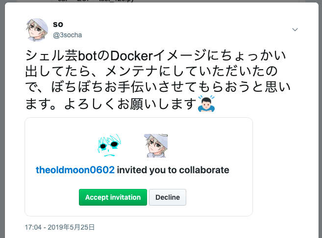

# <!--fit--> シェル芸botイメージのチューニング

## 第42回 シェル芸勉強回 松江サテライト LT

## so

## 2019/6/15

---

# `$ whoami`

- so
  - Twitter: [@3socha](https://twitter.com/3socha)
- シェル芸
  - 普段は[大阪サテライト](https://atnd.org/groups/shellgei_osaka)の会場担当
  - 今回、初めて[松江サテライト](https://atnd.org/events/106474)を開催
- インフラエンジニア
  - 主に AWS 関連
  - 最近は ECS, Fargate, Lambda, CloudFormation 等
  - CI/CD: CodeBuild, CodeDeploy, CodePipeline

---

# 最近の活動 1

---

# [`unko.puzzle`](https://github.com/unkontributors/super_unko/blob/master/bin/unko.puzzle) を作った


- [bigunko](https://github.com/unkontributors/super_unko/blob/master/bin/bigunko.show) のスライディングブロックパズル（15パズル）

---

# `unko.puzzle` 経緯

- 前回のシェル芸勉強会 東京会場の LT で [@s_mitu](https://twitter.com/s_mitu) さんが「[シェル芸でターミナルなどを動かす](https://www.slideshare.net/s_mitu/cui-142486811)」という発表をされた
	- `xwit` コマンドを使ってウィンドウを動かす方法を[紹介](https://youtu.be/FxTJot6iCzk?t=777)
- これを参考に `xdotool` で、ウィンドウ自体を動かす
	- macOS では XQuartz 上の xterm でのみ利用可
- [unkontributors/super_unko](https://github.com/unkontributors/super_unko) に PR を送ったら取り込んでもらえた
	- bigunko:shit:をうまく刻むために、bigunko をキレイ:sparkles:にする PR も送った
	- いつの間にか、unkontributors になっていた:thinking:

---

# 最近の活動 2

---

# [`saizeriya`](https://github.com/horo17/saizeriya) コマンドを作った

- サイゼリヤで1000円xxxが流行った


- ぐれさんにそそのかされて雑に作ってみた

```sh
$ saizeriya
セロリのピクルス(季節限定)
```

---

# `saizeriya`

- シェル芸botにも入れてもらいました


---

# 最近の活動 3

---

# シェル芸勉強会 [松江サテライト](https://atnd.org/events/106474) 初開催

 

- ありがとうございます

---


# Q. なんで松江:thinking:

## A. 酒:sake:と魚:fish:が美味いから

---

# 最近の活動 4

---

# シェル芸botのDockerイメージメンテナンス

- GW 後半頃から、[ShellgeiBot-Image](https://github.com/theoldmoon0602/ShellgeiBot-Image) に Pull Request を送っていたら、メンテナにしていただいた


- 今日の本題

---

# シェル芸botを支える技術

## 今日話すこと

- シェル芸bot Docker イメージのチューニング
- シェル芸bot Docker イメージのテスト
- CircleCI への対応

## 話さないこと

- シェル芸bot本体のこと
	- 開発者([@theoldmoon0602](https://twitter.com/theoldmoon0602))のブログを参照
	- [今の所判明しているシェル芸botの仕様](https://furutsuki.hatenablog.com/entry/2018/07/13/221806)

---

# しくみ


---

# リソース

- https://github.com/theoldmoon0602/ShellgeiBot/
  - シェル芸bot本体のソースコード
- https://github.com/theoldmoon0602/ShellgeiBot-Image/
  - シェル芸bot用 Dockerイメージのソースコード
  - ShellgeiBot リポジトリから分離
- https://hub.docker.com/r/theoldmoon0602/shellgeibot
  - ビルド済みのDockerイメージ

---

# シェル芸botと(概ね)同じ環境を用意

- Docker をインストール: 省略
- Docker イメージを取得
  ```sh
  $ docker pull theoldmoon0602/shellgeibot
  ```
  - 圧縮された状態で 3GB 程度あるため、注意
- Docker コンテナを作成
  ```sh
  $ mkdir -p images  # 画像の出力先を用意
  $ docker run -it --rm \
    --net none \
    --memory 100m \
    --oom-kill-disable \
    --pids-limit 1024 \
    --cap-add sys_ptrace \
    --volume $(pwd)/images:/images \
    theoldmoon0602/shellgeibot bash
  ```
- Twetter に投げなくても、手元で思いついたシェル芸を試せる

---

# シェル芸botのセキュリティ

- Dockerコンテナ上でコマンド実行
  - プロセス空間, ファイルシステムをホストから分離
- ネットワークインタフェースはループバックのみ
  - シェル芸で余所のサーバーに迷惑をかけないように
- メモリ、プロセス数制限
  - forkbomb 等でホストのリソースを食い潰さないように
- 実行時間
  - シェル芸botでは最大20秒に制限されている

---

# Dockerイメージをビルドする

- Docker 18.09 以上で実行

```sh
$ git clone https://github.com/theoldmoon0602/ShellgeiBot-Image.git
$ cd ShellgeiBot-Image
$ DOCKER_BUILDKIT=1 docker image build --tag shellgeibot .
```

- [Dockerfile](https://github.com/theoldmoon0602/ShellgeiBot-Image/blob/master/Dockerfile) に定義されたコマンドが実行され、イメージが作られる
- 大容量のデータがダウンロードされるため注意
- PCと回線次第だが、ビルドには15~30分程度かかる

---

# シェル芸botにコマンドを追加したい

- Dockerfile に設定を追加し、Pull Request を送ろう
  - [ojichat](https://github.com/theoldmoon0602/ShellgeiBot-Image/pull/6/files)
  - [faketime](https://github.com/theoldmoon0602/ShellgeiBot-Image/pull/15/files)

---

# 課題

- コマンド追加時に Docker イメージを再ビルドしようとすると、とても時間がかかる
  - ネットワークにも負荷がかかる
  - 慣れていないと、試行錯誤が難しい
- Docker の知識がいるためちょっと難しい
  - 特に最近の変更で、謎の記述がいっぱい増えた
- 今まで動いていたシェル芸が動かなくなるかもしれない

---

# Dockerfile を取り回しやすくする

- Docker イメージビルドの高速化
- Docker イメージサイズの低減
- 効率的なキャッシュの活用
- ビルドした Docker イメージのテストを実施

---

# Dockerfile 基本

- 例: Ubuntu 19.04 をベースに、`cowsay` と[おじさんがLINEやメールで送ってきそうな文を生成するコマンド](https://github.com/greymd/ojichat) を追加する
  ```Dockerfile
  FROM ubuntu:19.04

  RUN apt-get update
  RUN apt-get install -y curl git cowsay language-pack-ja

  RUN curl -sL -o go.tar.gz https://dl.google.com/go/go1.12.linux-amd64.tar.gz
  RUN tar xf go.tar.gz -C /usr/local

  ENV LANG ja_JP.UTF-8
  ENV GOPATH /root/go
  ENV PATH $PATH:/usr/local/go/bin:/root/go/bin:/usr/games

  RUN go get github.com/greymd/ojichat
  ```

- `FROM`: ベースにする Docker イメージ
- `RUN`: コマンドを実行, `ENV`: 環境変数を設定

---

# ビルドする

- `sample:base` というタグを付けてイメージをビルド

```sh
$ docker build --file base.Dockerfile --tag sample:base .
```

- ビルドしたイメージ

```sh
$ docker images
REPOSITORY     TAG       IMAGE ID         CREATED           SIZE
sample         base      78d895c31aaf     2 minutes ago     873MB
ubuntu         19.04     9b17fc7d6848     3 weeks ago       75.4MB
```

---

# 実行する

- コマンドを直接実行
  ```sh
  $ docker run --rm sample:base ojichat
  ```

- シェルを起動してインタラクティブに実行
  ```sh
  $ docker run -it --rm sample:base bash
  # ojichat | cowsay
  ```
  - `-i`: インタラクティブに実行
  - `-t`: コンテナのプロセスに tty を割り当て
  - `--rm`: 実行後に自動的にDockerコンテナを削除

---

# Docker イメージのレイヤ

- Dockerfile での各ステップ(`RUN`, `ENV` 等)の実行結果が、読み込み専用のレイヤとして積み重ねられ、1つに統合された形に見える


- 後のステップ(上のレイヤ)でファイルを削除しても、下のレイヤでは保持されたまま

図は [Docker Engine ユーザガイド](http://docs.docker.jp/v1.12/engine/userguide/storagedriver/imagesandcontainers.html) より引用

---

# Docker イメージのレイヤ

```sh
$ docker images --all
REPOSITORY     TAG        IMAGE ID         CREATED           SIZE
sample         base       62fcd86b390f     5 minutes ago     873MB
<none>         <none>     9866d94476d1     6 minutes ago     686MB
<none>         <none>     58441dae5c12     6 minutes ago     686MB
<none>         <none>     98ed5cf6070b     6 minutes ago     686MB
<none>         <none>     92b1431bf17a     6 minutes ago     686MB
<none>         <none>     7926ccd74753     6 minutes ago     349MB
<none>         <none>     cfb01d69535d     6 minutes ago     221MB
<none>         <none>     90fcd46bb938     7 minutes ago     98.9MB
ubuntu         19.04      9b17fc7d6848     3 weeks ago       75.4MB
```

- `<none>` はタグ付けされていない中間レイヤ
- Dockerfile に別のコマンドの設定を追加してビルドすると、変更のない場所はビルド済みのレイヤ使われ、差分が発生した箇所から別のレイヤが積み重ねられていく
- レイヤの実装はストレージドライバ(aufs, overlay2等)毎に異なる

---

# Docker コンテナのレイヤ


- Docker コンテナの実行時は、読み書き可能なレイヤが追加される
- シェル芸botで `rm -rf /` を実行しても、Docker イメージやホストに影響がない

図は [Docker Engine ユーザガイド](http://docs.docker.jp/v1.12/engine/userguide/storagedriver/imagesandcontainers.html) より引用

---

# これをベースに軽量化、ビルドを高速化する


- あれこれいじくりすぎて、シェル芸bot 作者もわからなくなってしまった Dockerfile を、ちゃんと解説してみる

---

# まず、テストを書く

- [bats](https://github.com/sstephenson/bats) - Bash Automated Testing System を利用

```bats
@test "cowsay" {
  run cowsay シェル芸
  [ $status -eq 0 ]
  [ "${lines[1]}" = '< シェル芸 >' ]
}

@test "ojichat" {
  run ojichat --version
  [ $status -eq 0 ]
  [[ "${lines[0]}" =~ 'Ojisan Nanchatte (ojichat) command' ]]
}
```

- ここでは 2 コマンドだけだが、シェル芸botの Docker イメージではたくさんのコマンドがインストールされている
- 簡単なテストを書いて、修正前後で同じように動くことを確認する

---

# テスト実行

- `docker_image.bats` を含むローカルディレクトリをボリュームマウントして実行

```bats
$ docker run --volume $(pwd):/root/src --rm sample:base \
  bash -c 'apt-get update && apt-get install -y bats \
    && bats /root/src/docker_image.bats'
(snip)
1..2
ok 1 cowsay
ok 2 ojichat
```

- テストの度に毎回 `bats` をインストールしていると時間がかかるため、シェル芸bot の Docker イメージには `bats` 自体も含めている

---

# 1) 実行時に不要なリソースを含めない

- ojichat を追加するだけでとても大きなイメージになってしまった
  - ubuntu:19.04 - 75.4MB
  - sample:latest - 873MB
- ojichat のバイナリを実行するには不要なリソースがたくさん含まれている
  - apt パッケージリストのキャッシュ
  - ダウンロードした Go のアーカイブ, ソースコード
- 各コマンド && でつなげ、1回の`RUN`で複数の操作をこなす
  - Dockerfile がメンテナンスしづらくなるため、やりすぎ注意
- 参考
  - [Dockerfile のベストプラクティス](http://docs.docker.jp/engine/articles/dockerfile_best-practice.html)
  - [Dockerfile を書くためのベストプラクティス解説編](https://www.slideshare.net/zembutsu/explaining-best-practices-for-writing-dockerfiles)

---

# Dockerfile 修正 (前半)

```Dockerfile
FROM ubuntu:19.04

RUN apt-get update \
  && apt-get install -y --no-install-recommends \
    curl git ca-certificates cowsay language-pack-ja locales \
  && apt-get clean \
  && rm -rf /var/lib/apt/lists/*

ENV LANG ja_JP.UTF-8
```

- apt のキャッシュを削除
- apt の推奨パッケージをインストールしない
  - `apt-get install` に `--no-install-recommends` を指定
  - 推奨パッケージに入っていた SSL 証明書の更新(`ca-certificates`)、`locales` は必要なので、追加で指定
  - シェル芸bot ではまだやっていない

---

# Dockerfile 修正(後半)

```Dockerfile
ENV GOPATH /root/go
RUN curl -sS --retry 3 -o go.tar.gz https://dl.google.com/go/go1.12.linux-amd64.tar.gz \
  && tar xf go.tar.gz -C /usr/local \
  && rm go.tar.gz \
  && /usr/local/go/bin/go get github.com/greymd/ojichat \
  && find /usr/local/go /root/go/src -type f | grep -viE 'license|readme' | xargs rm \
  && find /usr/local/go /root/go/src -type d -empty -delete
ENV PATH $PATH:/root/go/bin:/usr/games
```

- Go 本体、ojichat、ojichat の依存ライブラリのソースコードも削除
  - イメージを配布できるよう、LICENSE ファイル類は残す
  - シェル芸botの Docker イメージでは `sayhuuzoku` が `go` コマンドを必要とするため、一部残している
- Dockerfile でシェル芸したら、すごく読みづらい

---

# ビルド結果

```sh
$ docker images --all
REPOSITORY     TAG        IMAGE ID         CREATED           SIZE
sample         1st        ed5c42e81329     5 minutes ago     225MB
<none>         <none>     f98b9da78b7b     5 minutes ago     225MB
<none>         <none>     c74ccf9c0a37     6 minutes ago     190MB
<none>         <none>     dad2c62f9cbb     6 minutes ago     190MB
<none>         <none>     a431d0c4e4c9     6 minutes ago     190MB
ubuntu         19.04      9b17fc7d6848     3 weeks ago       75.4MB
```

- イメージサイズが 873MB から 225MB まで減った
- 不要なパッケージを取得しないため、ビルド時間も短縮
- テストもちゃんと通る

---

# 課題

- ojichat の実行だけであれば、curl や git は不要
  - (シェル芸botのDockerイメージには入れているが)
- すべてのコマンドを`RUN`で繋げて、最後に `apt-get purge`, `apt-get autoremove` で不要なパッケージを削除する?
  - Dockerfile の可読性が悪くなり、ビルド済みレイヤーのキャッシュも使えなくなる

---

# 2) ビルド用のステージを分離する

- Docker 17.05 で追加された、マルチステージビルドを利用する
  - 1つの Dockerfile に `FROM` を複数回書ける
- ビルド用のステージと実行用のステージを用意する
  - git, curl はビルド用ステージで利用
  - ビルドステージでビルドした ojichat の実行ファイルを実行用イメージにコピー

---

# Dockerfile 修正 (ビルド用ステージ)

```Dockerfile
FROM ubuntu:19.04 AS builder
RUN apt-get update && apt-get install -y --no-install-recommends \
    curl git ca-certificates
RUN curl -s -o go.tar.gz https://dl.google.com/go/go1.12.linux-amd64.tar.gz \
  && tar xzf go.tar.gz -C /usr/local

ENV GOPATH /root/go
ENV PATH $PATH:/usr/local/go/bin
RUN go get github.com/greymd/ojichat
RUN find /usr/local/go/src /root/go/src -type f \
    | grep -Ei 'license|readme' \
    | xargs -I@ echo "mkdir -p /tmp@; cp @ /tmp@" \
    | sed -e 's!/[^/]*;!;!' | bash
```

- `FROM ... AS ...` でステージに名前を付ける
- リソースの削除をしていない
- 実行用ステージにコピーしやすいよう、`/tmp` 以下に LICENSE ファイル類をコピー

---

# Dockerfile 修正 (実行用ステージ)

```Dockerfile
FROM ubuntu:19.04 AS runtime
ENV LANG ja_JP.UTF-8
ENV PATH $PATH:/usr/games

RUN apt-get update \
  && apt-get install -y --no-install-recommends cowsay language-pack-ja locales \
  && apt-get clean \
  && rm -rf /var/lib/apt/lists/*

COPY --from=builder /root/go/bin /usr/local/bin
COPY --from=builder /tmp/usr/local/go /usr/local/go
COPY --from=builder /tmp/root/go /root/go
```

- `COPY --from=build ...` でビルド用ステージから必要なファイルのみコピー
- `curl`, `git` は最終的なイメージに含まず

---

# ビルド結果

```
$ docker images
REPOSITORY     TAG        IMAGE ID         CREATED           SIZE
sample         2nd        baecd2d966ca     2 minutes ago     168MB
<none>         <none>     606b5da746bf     2 minutes ago     841MB
ubuntu         19.04      9b17fc7d6848     3 weeks ago       75.4MB
```

- 225MB から 168MB まで減った
- ビルド用ステージはタグが付与されないイメージとして残る
  - 不要なら削除
    ```sh
    $ docker images --filter dangling=true -q |\
      xargs docker rmi
    ```

---

# 中間ステージの再利用 (おまけ)

- 中間ステージにタグを付与
  ```sh
  $ docker build --file 2nd.Dockerfile --target builder --tag sample:2nd-builder .
  ```
- 中間ステージをキャッシュに利用してビルド
  ```sh
  $ docker build --file 2nd.Dockerfile \
    --cache-from sample:2nd-builder --tag sample:2nd .
  ```
  - CI 環境で、ビルド済みの中間ステージを push または save
  - 次回ビルド時に pull または load し、`--cache-from` に指定
  - イメージの転送時間より、ビルド時間が長い場合に有効
  - 参考: [multi stageなDockerfileで中間イメージにタグをつける](https://qiita.com/yagince/items/33a7e4d1818cb7b9648e)
- シェル芸botの CI では採用していない
  - 常に最新のリポジトリからビルドしたいため
  - ほとんど早くならないか、または逆に遅くなるため

---

# 課題

- ビルドステージに別ツールの設定を追加すると、後のステップで実行される apt パッケージには変更がないのに再実行されてしまう

---

# 3) BuildKit を利用する

- Docker イメージのビルドを効率化する、新しいビルドツール
- Dockerfile から LLB (low-level builder) と呼ばれる各ステップの依存グラフを表す中間言語を生成し、ビルド
   - 依存のないステージは並列にビルドされる
- Docker 18.09 から利用可能
  - 環境変数に `DOCKER_BUILDKIT=1` を設定
  - または docker daemon の設定ファイル(`/etc/docker/daemon.json` か `~/.docker/daemon.json`)に `{"features": {"buildkit": true}}` を追記して docker daemon を再起動
- 参考
  - [BuildKitによる高速でセキュアなイメージビルド](https://www.slideshare.net/AkihiroSuda/buildkit)
  - [Dockerfileを改善するためのBest Practice 2019年版](https://www.slideshare.net/zembutsu/dockerfile-bestpractices-19-and-advice)

---

# Buildkit を利用してビルド

- Dockerfile は特に変更せず、BuildKit を有効化してビルド
  ```sh
  $ DOCKER_BUILDKIT=1 docker image build -f 2nd.Dockerfile --tag sample:3rd .
  [+] Building 71.4s (14/14) FINISHED
  => [internal] load build definition from 2nd.Dockerfile               0.0s
  => => transferring dockerfile: 933B                                   0.0s
  => [internal] load .dockerignore                                      0.0s
  => => transferring context: 2B                                        0.0s
  => [internal] load metadata for docker.io/library/ubuntu:19.04        0.0s
  => CACHED [internal] helper image for file operations                 0.0s
  => CACHED [runtime 1/5] FROM docker.io/library/ubuntu:19.04           0.0s
  => [builder 2/5] RUN apt-get update   && apt-get install -y --no-ins 22.0s
  => [runtime 2/5] RUN apt-get update   && apt-get install -y --no-ins 20.4s
  => [builder 3/5] RUN curl -s -o go.tar.gz https://dl.google.com/go/g 14.5s
  => [builder 4/5] RUN go get github.com/greymd/ojichat                30.4s
  => [builder 5/5] RUN find /usr/local/go/src /root/go/src -type f      0.9s
  => [runtime 3/5] COPY --from=builder /root/go/bin /usr/local/bin      1.0s
  snip)
  ```

- `COPY` 前までが並列に実行されている

---

# ビルドステージを修正してみる

- [終焉にまつわるアスキーアートを出力するだけのコマンド](https://github.com/xztaityozx/owari)を追加

```diff
  ...
  RUN go get github.com/greymd/ojichat
+ RUN go get github.com/xztaityozx/owari
  RUN find /usr/local/go/src /root/go/src -type f |\
  ...
```

---

# ビルド

```bash
$ DOCKER_BUILDKIT=1 docker image build -f 2ndAdd.Dockerfile --tag sample:3rdAdd .
[+] Building 18.0s (15/15) FINISHED
 => [internal] load build definition from 2ndAdd.Dockerfile                  0.0s
 => => transferring dockerfile: 976B                                         0.0s
 => [internal] load .dockerignore                                            0.0s
 => => transferring context: 2B                                              0.0s
 => [internal] load metadata for docker.io/library/ubuntu:19.04              0.0s
 => [runtime 1/5] FROM docker.io/library/ubuntu:19.04                        0.0s
 => CACHED [internal] helper image for file operations                       0.0s
 => CACHED [builder 2/6] RUN apt-get update   && apt-get install -y --no-in  0.0s
 => CACHED [builder 3/6] RUN curl -s -o go.tar.gz https://dl.google.com/go/  0.0s
 => CACHED [builder 4/6] RUN go get github.com/greymd/ojichat                0.0s
 => [builder 5/6] RUN go get github.com/xztaityozx/owari                    14.4s
 => [builder 6/6] RUN find /usr/local/go/src /root/go/src -type f     | gre  1.0s
 => CACHED [runtime 2/5] RUN apt-get update   && apt-get install -y --no-in  0.0s
(snip)
```

- runtime での apt-get はキャッシュ済みのレイヤが利用された

---

# 注意点

- BuildKit を有効にしてビルドした場合、`--cache-from` が使えない
  - https://github.com/moby/moby/issues/39003
  - BuildKit が既存とは異なるキャッシュフォーマットを利用するため
- キャッシュレイヤーの export / import が未サポート
  - https://github.com/moby/buildkit/issues/723
  - BuildKit は対応済み、Frontend でそのうち対応されるはず
- 中間イメージがストレージを食い尽くす
  - `$ docker images` で表示されない

  ```sh
  $ docker builder prune
  WARNING! This will remove all dangling build cache. Are you sure you want to continue? [y/N]
  ```

---

# 課題

- `apt-get update` が別々のステージで2回実行されているのが無駄
- runtime の apt-get にパッケージを加えた場合、全パッケージが再ダウンロードされる

---

# 4) ダウンロード済みリソースをキャッシュ

- BuildKit の `RUN --mount=type=xxx` を利用する
  - Experimental な機能で、Dockerfile から LLB を出力するプログラム (フロントエンド) のコンテナイメージを指定する宣言が必要
  - `# syntax = docker/dockerfile:1.0-experimental`
  - type: bind, cache, tmpfs, secret, ssh
  - bind: イメージ内のディレクトリをビルドコンテナにバインド
  - cache: コンパイラやパッケージマネージャのディレクトリをキャッシュ

- 参考
  - [Dockerfile frontend experimental syntaxes](https://github.com/moby/buildkit/blob/master/frontend/dockerfile/docs/experimental.md)

---

# Dockerfile 修正 1/4

```Dockerfile
# syntax = docker/dockerfile:1.0-experimental
FROM ubuntu:19.04 AS apt-cache
RUN apt-get update

FROM ubuntu:19.04 AS base
RUN rm -f /etc/apt/apt.conf.d/docker-clean; \
    echo 'Binary::apt::APT::Keep-Downloaded-Packages "true";' \
    > /etc/apt/apt.conf.d/keep-cache
```

- `apt-cache` ステージ
  - apt パッケージリストをダウンロードしてくるのみ
  - 別のステージで bind して利用する

- `base` ステージ
  - Ubuntu 19.04 の docker イメージで、ダウンロードしたパッケージファイルを保存しない設定になっているのを解除

---

# Dockerfile 修正 2/4

```Dockerfile
FROM base AS builder
RUN --mount=type=bind,target=/var/lib/apt/lists,from=apt-cache,source=/var/lib/apt/lists \
    --mount=type=cache,target=/var/cache/apt,sharing=private \
    apt-get install -y --no-install-recommends curl git ca-certificates
RUN curl -s -o go.tar.gz https://dl.google.com/go/go1.12.linux-amd64.tar.gz \
  && tar xzf go.tar.gz -C /usr/local
```

- `base` ステージからビルド用ステージと実行用ステージを派生
- apt パッケージリストは `apt-cache` ステージの `/var/lib/apt/lists` を読み込み専用でバインド
  - `apt-get update` の実行は `apt-cache` ステージで 1回だけ
- apt パッケージは `/var/lib/apt/lists` にダウンロードされる
  - 他のステージと同時に実行されると競合してこけるため、共有しないように `sharing=private` を指定

---

# Dockerfile 修正 3/4

```Dockerfile
ENV GOPATH /root/go
ENV PATH $PATH:/usr/local/go/bin
RUN --mount=type=cache,target=/root/go/src \
    --mount=type=cache,target=/root/.cache/go-build \
    go get -u github.com/greymd/ojichat \
  && find /usr/local/go/src /root/go/src -type f \
    | grep -Ei 'license|readme' \
    | xargs -I@ echo "mkdir -p /tmp@; cp @ /tmp@" \
    | sed -e 's!/[^/]*;!;!' | bash
```

- `go get` 実行時にソースコードがダウンロードされるディレクトリをキャッシュ
  - 実行用ステージにコピーするため、LICENSE ファイル類は /tmp 以下にコピー
- `GOCACHE` (`/root/.cache/go-build`) もキャッシュ

---

# Dockerfile 修正 4/4

```Dockerfile
FROM base AS runtime
ENV LANG ja_JP.UTF-8
ENV PATH $PATH:/usr/games

RUN --mount=type=bind,target=/var/lib/apt/lists,from=apt-cache,source=/var/lib/apt/lists \
    --mount=type=cache,target=/var/cache/apt,sharing=private \
    apt-get install -y --no-install-recommends cowsay language-pack-ja locales

COPY --from=builder /root/go/bin /usr/local/bin
COPY --from=builder /tmp/usr/local/go /usr/local/go
COPY --from=builder /tmp/root/go /root/go

RUN rm /etc/apt/apt.conf.d/keep-cache
COPY --from=ubuntu:19.04 /etc/apt/apt.conf.d/docker-clean /etc/apt/apt.conf.d/docker-clean
```

- 最後に削除した apt の設定ファイルを、ubuntu:19.04 から戻す

---

# ステージ間の依存関係


---

# 効果

- パッケージマネージャーやビルドのキャッシュが効くため、キャッシュ済みの場合にビルドが高速化
  - ローカルで試行錯誤しやすくなった
  - クラウド CI 環境では毎回新しい環境が用意されるためあまり効果はない

# 注意点

- BuildKit でのキャッシュに不整合が発生した時、`--no-cache` は効かず、`docker builder prune` で削除する必要がある...?
  - `go get` が他の要因で中途半端に止まった時に、この現象に陥った

---

# その他の改善

- Git リポジトリを shallow clone
  - `git clone` に `--depth 1` を付与し、対象のコミットのみ取得
- Go のバイナリにデバッグシンボルを含めないようビルド
  - `go get -ldflags '-w -s' ...`
- 不要パッケージ削減
  - gem (Ruby), pip (Python), npm (Node.js) などのパッケージマネージャは、ビルドステージでのライブラリ収集にのみ利用
  - Rust の標準ツールチェーン
    - Rust シェル芸は見たことがないので良いかな...
  - ヘッダファイル類

---

# CI

- CircleCI でビルド、テストが走る
  - Pull Request で Docker イメージのビルドと bats でのテストが走る
  - master ブランチへのコミット (マージ) 時と、日次で Docker イメージをビルドし、DockerHub にpush、シェル芸bot の起動イメージ差し替えが走る
- CI では、キャッシュは一切利用せず
  - おそらくネットワーク的にパッケージリポジトリに近く、キャッシュを利用する方が時間がかかる
- [Docker Layer Caching](https://circleci.com/docs/2.0/docker-layer-caching/) というオプションもあるが、有償のため利用していない
  - BuildKit のレイヤーキャッシュにはまだ対応していない?

---

# 試してみてやめたこと

- apt のダウンロード済みパッケージを CircleCI でキャッシュ
  - とても複雑になったのに、逆にビルドが遅くなった
    - [残骸](https://github.com/theoldmoon0602/ShellgeiBot-Image/compare/master...horo17:enable-apt-cache-on-circleci)
- ワタナベ難読化コマンド (`noc`) 用の `mono` の代わりに .NET Core 利用
  - mono-runtime + noc : 6.31GB
  - .NET Core runtime + Release ビルドの noc : 6.47GB

---

# まとめ

## Dockerfile を取り回しやすくした

- 本当? :thinking:

## ビルド時間短縮

- ローカルで、キャッシュの効いてる場合はそれなりに

## イメージサイズ削減

```sh
REPOSITORY                  TAG        IMAGE ID      SIZE
theoldmoon0602/shellgeibot  20190504   5b705a743629  9.64GB
theoldmoon0602/shellgeibot  20190614   f4b1cf09a523  6.31GB
```

---

# 今取り組んでいること

- [PR#17](https://github.com/theoldmoon0602/ShellgeiBot-Image/pull/17) 実行用イメージでも apt 推奨パッケージを削除
  - [削除対象のパッケージ](https://github.com/theoldmoon0602/ShellgeiBot-Image/pull/17#issuecomment-501704831) が多く、いくつかのシェル芸が動かなくなるかも
  - **渾身のシェル芸が動かなくなりそうで心配な人はちょっと見てほしい**

- 手元でビルドした結果
  ```sh
  REPOSITORY                  TAG        IMAGE ID      SIZE
  shellgeibot                 latest     39cb5658dfd1  5.4GB
  ```

---

# おまけ

- Docker コンテナで `<C-p>` がうまく効かず、以前のコマンドが探索しづらい人向け
- デタッチ用のキーバインドがバッティングしているかも
  - 参考: [docker で Ctrl-p ２回押し問題 (detach-keys の問題) を解決するには](https://qiita.com/Yuki-Inoue/items/60ec916383025160fbb8#_reference-a2d9244a6c4496f4df05)

```json
$ cat ~/.docker/config.json
{
  "detachKeys" : "ctrl-\\"
}
```
